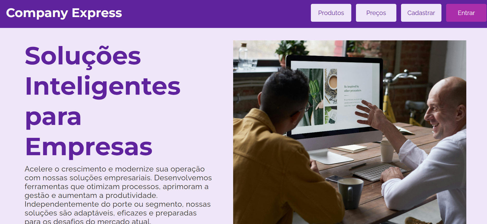
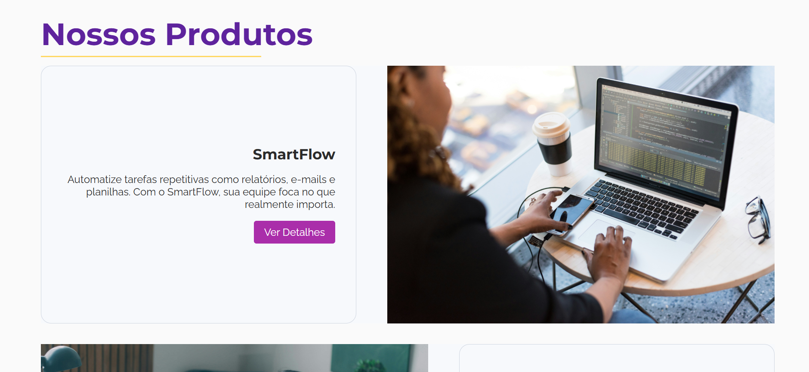
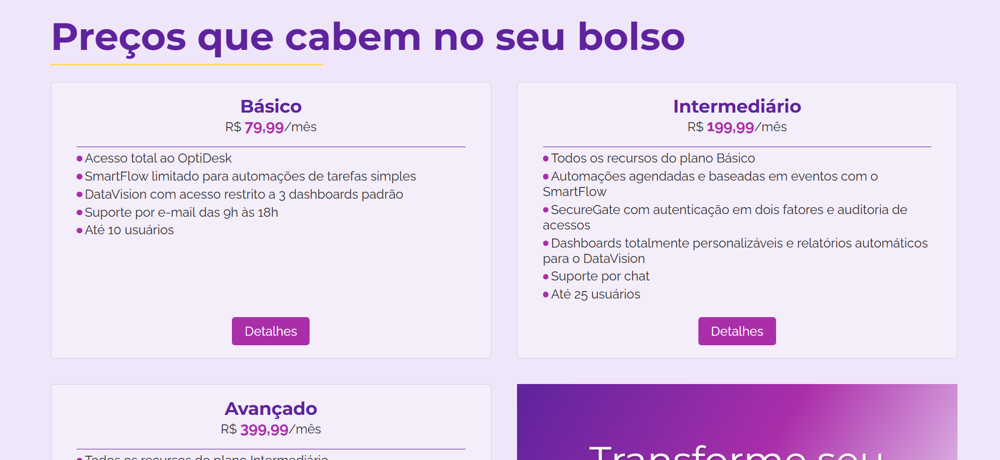
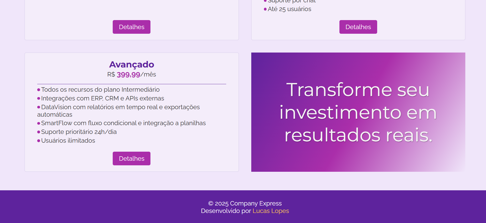

# Company Express 🏢

A **Company Express** é uma empresa fictícia que disponibiliza soluções SaaS (Software as a Service) para ajudar seus clientes a tomarem decisões estratégicas com base nos dados fornecidos pelos produtos comercializados.

Este repositório consiste na criação do front-end da plataforma, tendo como principal objetivo exercitar minhas habilidades de desenvolvimento web utilizando **grid**, **flexbox**, **pseudo-classes e elementos** e **media queries** para responsividade. Todo o código foi construído considerando uma boa estrutura semântica do HTML e boas práticas do JavaScript.

🔗Você pode visualizar o projeto em execução pelo link: [**Company Express**](https://lucas-h-lopes.github.io/company-express/).

## Tecnologias 💻

- HTML
- CSS
- JavaScript

## Instalação ⚙️

1. Clone o repositório com o comando `git clone https://github.com/lucas-h-lopes/company-express.git`

2. Abra o arquivo `index.html` no seu navegador

## Visualização do Projeto 👀

### Apresentação

### Produtos

### Preços

### Rodapé

